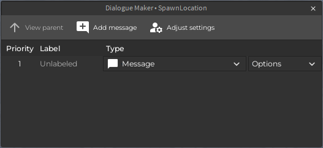

# Dialogue Maker Plugin

## About
Run the show with the Dialogue Maker Plugin: an open-source plugin for creating RPG-like dialogue boxes for NPCs in your Roblox game! It comes with a GUI that helps you add messages and player responses to your NPCs. 

## Features
### Responsive dialogue editor
The Dialogue Editor uses the power of Roblox Studio's Explorer to help you navigate dialogue trees. We let you create labels per dialogue item, which can help if you need to know which message is which before you open the script.

### Full support for Dialogue Maker Client
This plugin makes configuring Dialogue Maker Client easy. It creates scripts from pre-defined templates when you want to make a new conversation or configure a conversation tree.

### Update and recover Dialogue Maker Client
If we release a new update to Dialogue Maker Client, you can use this plugin to update the packages, easing the transition from an older version to a new one. You can also use the plugin to restore your packages if they become corrupted.

## Where can I get it?
You can either get [the version Beastslash updates at the Roblox Library](https://www.roblox.com/library/4930928141/Dialogue-Maker-Beta) or you can build your own version by using the scripts in this repository.

## How do I use it?
Check out the [documentation](/docs/README.md).

## Development
### Can I contribute?
Sure! If you feel like that the Dialogue Maker can be improved for everyone, just send a feature request in the issues. You could also submit a pull request if you already added it yourself. Beastslash will sync changes made between the plugin and repository.

Just be aware that your contribution available to anyone under the GPL-3.0 license. Read [LICENSE](./LICENSE) for more information.

## Acknowledgements
* [**Christian "Sudobeast" Toney**](https://christiantoney.com) - Producer and Lead Programmer
* [**BHickey94**](https://github.com/BHickey94) - Code Contributor
* [**GAVsi115**](https://devforum.roblox.com/u/gavsi115/summary) - Code Contributor and Bug Reporter
* [**extravent3**](https://devforum.roblox.com/u/extravent3/summary) - Issue Sponsor and Bug Reporter
* [**ruax2891**](https://twitter.com/ruax2891) - QA Tester
* [**InkyTheBlue**](https://twitter.com/InkyTheBlueDerg) - QA Tester
* [**BeatArcade**](https://www.roblox.com/users/2893686241/profile) - Bug Reporter
* [**joshuajon**](https://github.com/joshuajon) - Bug Reporter
* [**LordMerc**](https://devforum.roblox.com/u/lordmerc/summary) - Bug Reporter
* [**thomkok13**](https://devforum.roblox.com/u/thomkok13/summary) - Bug Reporter
* [**kitifulnines**](https://devforum.roblox.com/u/kitifulnines/summary**) - [Bug Reporter](https://github.com/Beastslash/roblox-dialogue-maker/issues/88)
* [**DavidColetta**](https://github.com/DavidColetta) - [Bug Reporter](https://github.com/Beastslash/roblox-dialogue-maker/issues/86)
