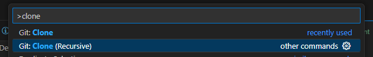
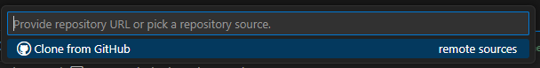
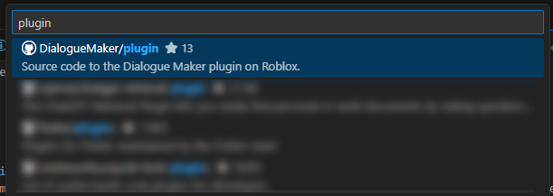
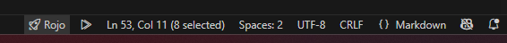
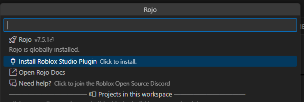

# Development
## Fork the repository if you need to
If you have write access to DialogueMaker/plugin, skip to the [next step](#recursively-clone-the-repository). If you don't, you're going to have to [fork the repository](https://docs.github.com/en/pull-requests/collaborating-with-pull-requests/working-with-forks/fork-a-repo). This essentially creates a sandbox environment for you to make your changes without affecting others.

## Recursively clone the repository
This repository use a [git submodule](https://github.blog/open-source/git/working-with-submodules/) to include the Dialogue Maker Client script in the plugin. This helps if you want to make quick edits to how that script works while also giving you control over the plugin code.

In this case, you should recursively clone the repository using the terminal or your favorite code editor.

### Using the terminal
Move to a comfortable folder where you can put your repositories, then run this command in your terminal after replacing `<REPOSITORY_NAME>` and `<REPOSITORY_OWNER>`.

```
git clone --recurse-submodules -j8 git://github.com/<REPOSITORY_OWNER>/<REPOSITORY_NAME>.git
```

This should create a folder for you.

### Using Visual Studio Code
If you're using Visual Studio Code, open the Command Palette (CTRL+SHIFT+P or CMD+SHIFT+P) and press the "Git: Clone (Recursive)" option.



Select "Clone from GitHub".



Select your repository. If you don't have write access to DialogueMaker/plugin, you need to select a [fork](#fork-the-repository-if-you-need-to).



After you select the repository, your file explorer should open for you to choose a place to put your repository.

> [!TIP] 
> If the DialogueClientScript directory shows up empty after cloning the repository, open the terminal in the folder and run this command to populate the DialogueClientScript:
> 
> ```bash
> git submodule update --init --recursive
> ```
> 
> You may need to run this again later. Submodules are kinda quirky.

## Install pesde
To develop with the plugin, you'll have to install some third-party tools. First up, [pesde](https://github.com/pesde-pkg/pesde/releases/tag/v0.7.0-rc.3%2Bregistry.0.2.3-rc.2): This is used for installing packzages that the plugin uses, such as [Rojo](https://rojo.space) and [React Lua](https://github.com/jsdotlua/react-lua). It's also used to install packages that the [client](https://github.com/DialogueMaker/client) uses. Be sure to use v0.7.0-rc3 or above because earlier versions of pesde require admin access. You can learn more about pesde here [on their website](https://docs.pesde.dev/).

After installing pesde, you can run the following command to install the remaining tools:

```bash
pesde install
```

## Install Rojo Roblox Studio plugin
The Rojo Roblox Studio plugin is used to sync your changes between your code editor and Roblox Studio.





## Make and test your feature
After installing the tools, you should be able to use Rojo. Serve [development.project.json](/development.project.json) to develop with the plugin.

Save DialoguePluginScript as a local plugin on Roblox Studio to test your changes.

Remember to regularly commit your changes with meaningful messages. This will help you remember what you did, and help others do the same.

## Submit a pull request when you're ready
TBA

---

Documentation writers: [Christian Toney](https://github.com/Christian-Toney)