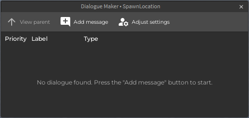

# Dialogue Maker
You can use the **Dialogue Maker** to easily change dialogue priorities, initialize and label [`Conversation`](/src/DialogueClientScript/Classes/Conversation/README.md) objects, and change dialogue types.

You can open it by pressing the [Create Conversation](/docs/toolbar/README.md#create-conversation) or [Edit Conversation](/docs/toolbar/README.md#edit-conversation) buttons on the plugin toolbar.

The dialogue editor window automatically closes if the Explorer selection changes to an instance that isn't a ModuleScript and a descendant of a [`Conversation`](/src/DialogueClientScript/Classes/Conversation/README.md) ModuleScript. 

## Why can't I edit text or settings in the Dialogue Maker?
Short reason: To protect you from malicious code. 

Long reason: See [issue #98](https://github.com/DialogueMaker/plugin/issues/98).

## Toolbar
### View parent
Selects the parent ModuleScript, if applicable. This button is disabled if there is no parent `Dialogue` or `Conversation` object.

### Add message
Adds a ModuleScript that contains a `Dialogue` object. This button does not automatically open the script. To do this, you need to press the "Options" dropdown on the new message, then press the "Configure" button.  

### Adjust settings
Opens the selected ModuleScript in Roblox's script editor so you can adjust the `Conversation` settings from there.

---

Documentation writers: Christian Toney